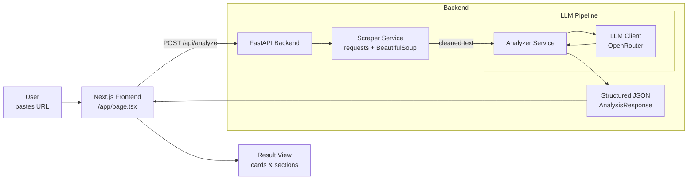

## Architecture & Pipeline

The AI Opportunity Analyzer is intentionally minimal but structured like a real consulting tool. It has two main layers:

- **Backend (FastAPI)**: orchestrates scraping and LLM-driven analysis, returning strict JSON.
- **Frontend (Next.js)**: presents a single, focused workflow for entering a URL and reviewing the resulting report.

---

### Backend pipeline

1. **Website extraction step (`scraper.py`)**

   - Accepts a public URL.
   - Uses `requests` with a configurable user agent and timeout.
   - Parses HTML with `BeautifulSoup`.
   - Extracts **visible** text from:
     - `h1`–`h4` headings
     - `p` paragraphs
     - `li` list items
   - Filters boilerplate (nav/footers where possible), normalizes whitespace, deduplicates lines.
   - Truncates to a configurable maximum character count before sending to the LLM.

2. **Company analyzer step (`analyzer.py`)**

   - Feeds the cleaned website text into a consultant-style system + user prompt.
   - Asks the LLM to infer:
     - What the company does
     - Likely industry and business model
     - Customer type(s)
   - Explicitly instructs the model to distinguish **facts from inferences** and to stay grounded.

3. **AI opportunity generation step**

   - Within the same LLM prompt, instructs the model to propose a small portfolio of concrete AI initiatives:
     - What the initiative is
     - Why it fits this specific company
     - Implementation complexity
     - Expected business value

4. **Architecture recommendation step**

   - The LLM is asked to propose a **high-level AI architecture** for an MVP:
     - Data sources and ingestion
     - Processing / feature pipelines
     - Model layer (training vs. retrieval vs. API-only)
     - Serving and integration patterns
     - Monitoring and governance considerations

5. **Assumptions / confidence step**

   - The LLM must:
     - List all key assumptions explicitly.
     - Describe confidence levels and where it is weaker (e.g., missing pricing page, no product docs).
   - All of this is returned as structured JSON aligned with the `AnalysisResponse` Pydantic model.

---

### Data contracts

The core response shape is:

- `company_profile` – core understanding of the business.
- `ai_opportunities[]` – portfolio of initiatives.
- `recommended_architecture` – overview, components, and reasoning.
- `impact_assessment` – impact narrative and areas.
- `assumptions[]` – explicit model assumptions.
- `confidence_notes` – narrative on how much to trust the output.

FastAPI enforces this via Pydantic models in `backend/app/models/schemas.py`. Any deviation from the schema results in an error before it reaches the frontend.

---

### Mermaid diagram

---

### Error handling & constraints

- **Scraper errors**
  - Network / HTTP issues → `400` with a readable message.
  - Insufficient content extracted → `400` with guidance to try a different URL.

- **LLM / analysis errors**
  - Invalid or non-JSON output → `500` with a generic analysis failure.
  - All unexpected exceptions are caught and surfaced as `500` with a safe message.

- **CORS**
  - Configured to allow local frontend origins (`localhost:3000`) by default.

This keeps the system small, understandable, and production-shaped—ideal for a portfolio piece that can be extended without feeling over-engineered.

